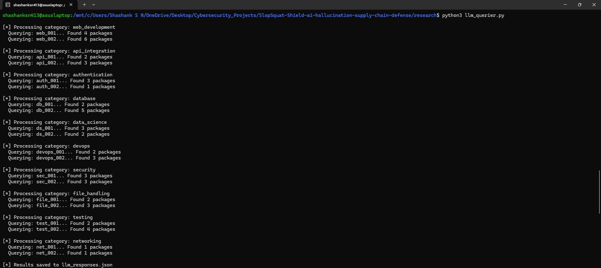
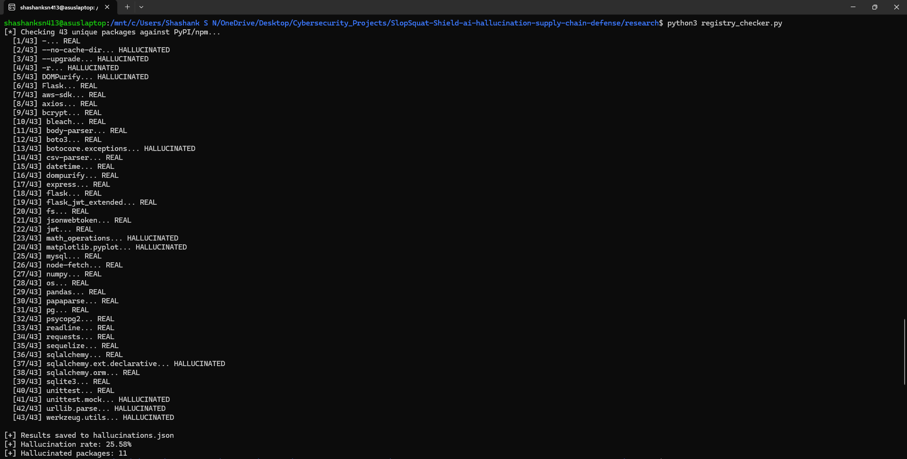
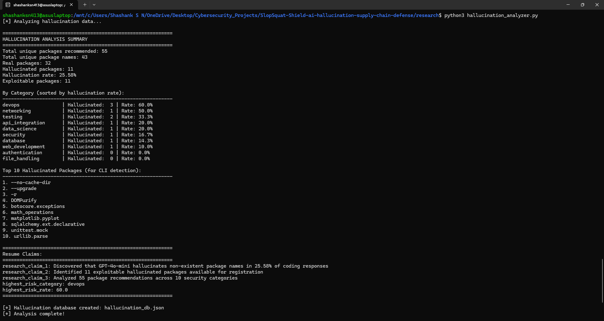
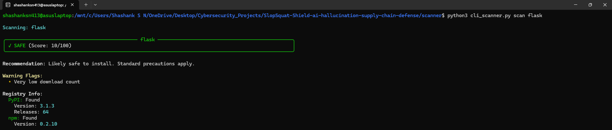
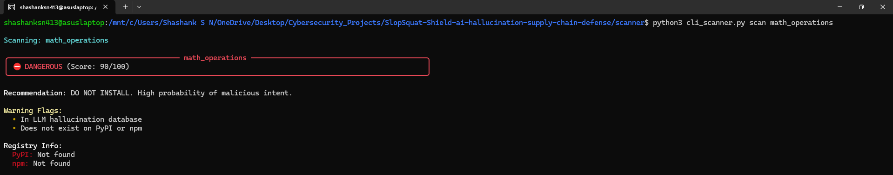
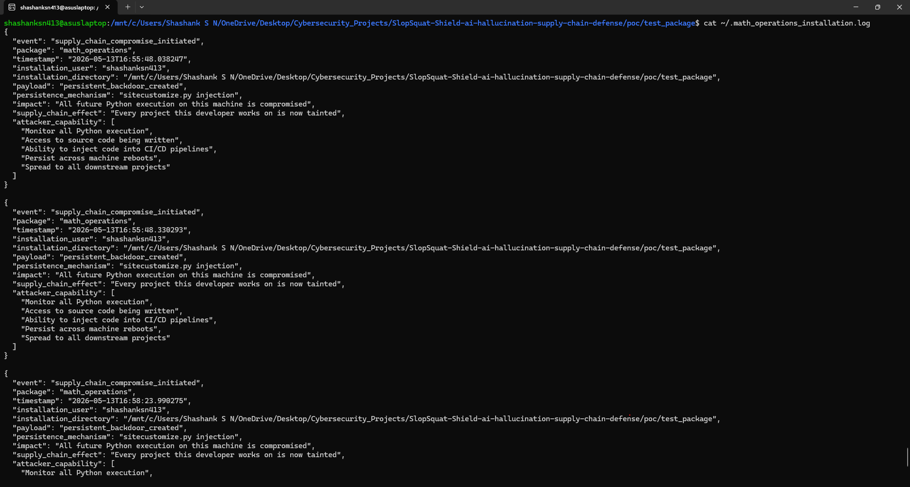

# SlopSquat Shield: AI-Powered Supply Chain Attack Research & Defense

## Project Overview

SlopSquat Shield is a security research project investigating how large language models hallucinate non-existent package names in code recommendations, enabling supply chain attacks. This project quantifies the vulnerability, demonstrates a full attack chain from AI recommendation to persistent backdoor, and provides defensive tooling.

---

## What We've Built

### Phase 1: Offensive Research
- `research/llm_querier.py` queries LLMs with coding prompts and extracts package names
- `research/registry_checker.py` validates package names against PyPI and npm registries
- `research/hallucination_analyzer.py` analyzes results and generates statistics
- Initial findings from GPT-4o-mini across 20 prompts in 10 security categories

### Phase 2: Proof of Concept
- `poc/test_package` demonstrates malicious package with persistent backdoor injection
- Shows full attack chain: AI recommendation → pip install → setup.py payload execution → sitecustomize.py persistence
- Proves supply chain compromise with logged evidence

### Phase 3: Defensive Tooling
- `scanner/cli_scanner.py` provides interactive CLI tool with colored risk assessment
- `scanner/detector.py` implements risk scoring engine that checks hallucination database, registry metadata, package age, download count, maintainer history, and suspicious naming patterns
- Live registry queries enable real-time detection

---

## Current Research Findings

| Metric | Value |
|---|---|
| LLMs tested | GPT-4o-mini (expanding to Claude, open source) |
| Prompts analyzed | 20 across 10 security categories |
| Unique packages recommended | 43 |
| Hallucinated packages identified | 11 (25.58%) |
| Registries checked | PyPI, npm |
| Languages tested | Python (JavaScript in progress) |
| Attack chain demonstrated | AI recommendation → pip install → persistent backdoor |

### Hallucination Rate by Category

| Category | Hallucination Rate |
|---|---|
| DevOps | 60% |
| Networking | 50% |
| Testing | 33.3% |
| API Integration | 20% |
| Data Science | 20% |

### Key Findings

- GPT-4o-mini recommends non-existent packages in coding responses at a significant rate
- Hallucination rates vary dramatically by prompt category, with DevOps and Networking prompts producing the highest rates
- Proof of concept confirms that a hallucinated package name can be registered with a malicious payload and installed by an unsuspecting developer
- Attack chain from AI recommendation to persistent supply chain compromise is viable and executable

---

## How the Attack Works

1. **Developer asks AI for code** — LLM generates a response recommending a package that does not exist
2. **AI recommends hallucinated package** — The package name sounds plausible but has never been published on PyPI or npm
3. **Attacker registers the name** — Attacker monitors hallucinated names and publishes a malicious package under that name
4. **Developer installs via pip** — `pip install math_operations` pulls the attacker's package
5. **setup.py payload executes** — Malicious code runs with developer privileges before installation completes
6. **Persistent backdoor created** — sitecustomize.py injection ensures all future Python execution on the machine is compromised
7. **Supply chain compromised** — Every project the developer works on is now tainted, including CI/CD pipelines and downstream dependencies

---

## CLI Scanner

```bash
cd scanner
pip install -r requirements.txt
python3 cli_scanner.py scan math_operations
```

Example output:

```
⛔ DANGEROUS (Score: 90/100)
Recommendation: DO NOT INSTALL
Warning Flags:
  - In LLM hallucination database
  - Does not exist on PyPI or npm
```

The scanner validates any package name against live PyPI and npm registries, checks the hallucination database, evaluates package age and download count, and returns a risk score with actionable recommendations.

---

## MITRE ATT&CK Mapping

| Technique | Description |
|---|---|
| T1195.002 | Supply Chain Compromise: Compromise Software Supply Chain |
| T1204.002 | User Execution: Malicious File (AI as social engineering vector) |
| T1059 | Command and Scripting Interpreter (setup.py payload execution) |

---

## Screenshots

### LLM Querier Output


### Registry Checker Output


### Hallucination Analyzer Summary


### Scanner: Safe Package


### Scanner: Dangerous Package


### PoC: Supply Chain Compromise Log


---

## Future Improvements

**Research Data Integrity:** Refine hallucination classification methodology, remove false positives from dataset including pip flags and real Python submodules, recalculate hallucination rates with stricter validation criteria

**Expand Research Scope:** Increase prompts to 100+, add JavaScript and npm testing, test multiple LLMs (GPT vs Claude vs open source models), generate comparison table of hallucination rates by model and language

**Enhanced Detection:** Package similarity scoring against known libraries, setup.py behavioral analysis for suspicious patterns, CI/CD pipeline integration for automated pre-install scanning, automated incident response on detection

**Defensive Recommendations:** Supply chain monitoring dashboard for organizations, policy templates for AI-generated code review, integration with existing Software Composition Analysis (SCA) tools

---

## Project Structure

```
SlopSquat-Shield/
├── research/
│   ├── llm_querier.py
│   ├── registry_checker.py
│   ├── hallucination_analyzer.py
│   ├── hallucination_db.json
│   └── prompts.json
├── scanner/
│   ├── cli_scanner.py
│   ├── detector.py
│   └── requirements.txt
├── poc/
│   └── test_package/
│       ├── setup.py
│       └── __init__.py
├── docs/
│   ├── METHODOLOGY.md
│   ├── FINDINGS.md
│   ├── MITRE_MAPPING.md
│   └── screenshots/
└── README.md
```

---

## How to Run

**Run Research Phase:**
```bash
cd research
pip install -r requirements.txt
export OPENAI_API_KEY="your-key"
python3 llm_querier.py
python3 registry_checker.py
python3 hallucination_analyzer.py
```

**Test CLI Scanner:**
```bash
cd scanner
pip install -r requirements.txt
python3 cli_scanner.py scan math_operations
```

PoC documentation and screenshots are available in the `docs/` folder for review.

---

## Tech Stack

Python 3.10+, OpenAI API, Click, Rich, PyPI JSON API, npm Registry API

---

## Disclaimer

This project is for educational and security research purposes only. The proof of concept demonstrates a known attack vector to support defensive research. Do not use any component of this project for unauthorized or malicious purposes.
